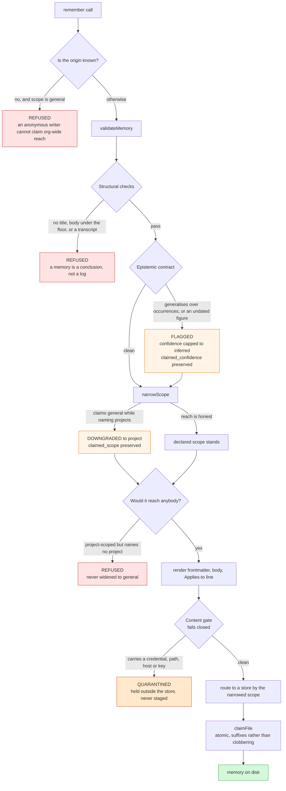
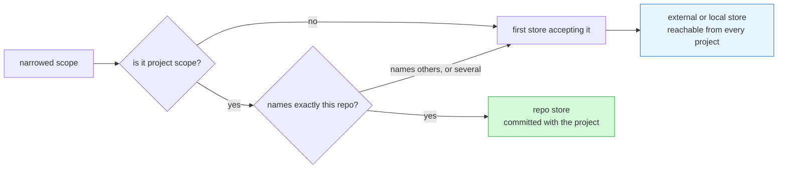
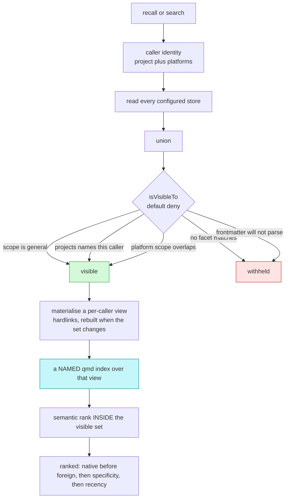
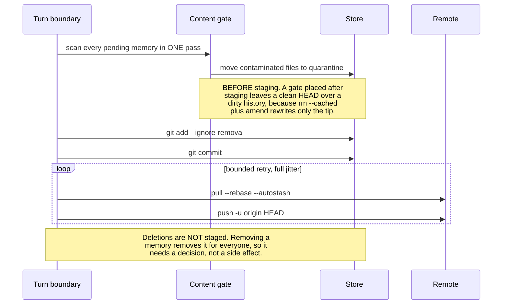

# Architecture

How a memory gets in, where it goes, and who can see it. Every box below is code that exists.

The whole design rests on one property: **reach is declared once, and everything else is derived from it.** Storage location, visibility and ranking are all computed from the same declaration, so they cannot drift apart.

---

## The pieces

```
core/lib/memory.ts       the write contract, reach filter and pool naming
core/lib/stores.ts       store kinds, routing, and materialising an external store
core/lib/index-view.ts   per-caller search index over exactly what a caller may see
core/lib/vestige.ts      the public API: remember, recall, search, explain
core/lib/sanitize.ts     the content gate
core/lib/sync.ts         git pull/push, deletion review, bounded retry
core/lib/protocol.ts     the text that makes an agent use the store
core/setup/qmd.ts        provisioning: install, update, heal
core/setup/doctor.mjs    diagnosis
core/setup/migrate.mjs   re-route memories when the configuration changes
host/                    the Claude Code surface: hooks, skills, commands, MCP
codex/                   the Codex surface: AGENTS.md and registration
```

`core/` is host-agnostic. Everything host-specific is a thin adapter, which is why the same server serves Claude Code and Codex, and why sync does not live in a hook — Codex has none.

---

## What makes any of it happen

Plumbing without a trigger is a store nobody writes to. `remember` and `search` existed for a while with nothing that ever called them, which is what this layer prevents.


Three deliberate choices:

- **The protocol goes in once per session, not once per turn.** Injecting every turn is the reliable choice and costs a paragraph of context forever; text that appears every turn also stops being read.
- **The gate advises and never hard-blocks.** A script bug must not become a gate with no escape. Nudges are budgeted per turn so the hook cannot drive a search-then-spawn loop.
- **Capturing nothing is the expected outcome.** Most sessions produce no durable memory, and a store full of near-misses is worse than a small one.

---

## The capture path

Five places can refuse or alter a write, and each records what it did.



**Reach is narrowed, never widened.** A memory claiming `general` while naming specific projects is scoped to them by its own admission. A memory that would reach *nobody* is **refused rather than widened**, because granting the widest possible reach when the narrowest could not be determined is the opposite of what narrowing is for.

**The gate fails closed and quarantines per file.** An unreadable file, an unevaluable rule or a scanner error all count as contaminated. The offending memory is held where its author can still see it, and the clean memories beside it still land — a gate that loses clean work is a gate people switch off.

---

## Where a memory goes

Storage is **configuration, not policy**. A store declares its kind and which scopes it accepts; a memory goes to the first store that accepts its narrowed scope.

| kind | where | for |
|---|---|---|
| `repo` | a directory inside the project repo | memories that travel with the code and are reviewed in its pull requests |
| `external` | a separate git repository, sparse-cloned into the workspace and locally excluded | team memory decoupled from any product repo |
| `local` | a plain directory | the personal default |



An `external` store is cloned single-branch, blobless and sparse, so only the memory markdown materialises. The remote is probed **before** anything is written — a missing SSH key, a dropped VPN, revoked access and a wrong branch otherwise all present as one empty directory. The checkout is excluded through `.git/info/exclude` rather than the project's `.gitignore`, because where an engineer keeps their memories is their choice and does not belong in shared source.

When the configuration changes, `core/setup/migrate.mjs` re-routes existing memories to the stores their reach now implies. It is a dry run by default, never overwrites a name already taken, and verifies each copy before removing the original.

---

## The recall path

**Filter first, rank second.** That order is the architecture. Reversing it — rank globally, then filter — is bounded by the retrieval engine's result ceiling, which does not move as the number of projects grows.



**Default deny is load-bearing.** A caller with no identity sees only `general` — the safest reading of "I do not know who you are". A memory whose frontmatter will not parse is visible to nobody: a memory whose reach cannot be read has not declared a reach.

**The index is per caller and named.** Isolation is a property of the index *name*, not of a directory — running `qmd init` in a per-caller directory silently creates nothing and every collection lands in the shared default index, which would put every project's memories in one place underneath a filter whose entire job is to keep them apart. Index builds are serialised with a cross-process lock, because two sessions building at once contend on one shared cache and the loser would otherwise degrade to unranked results without saying so.

**Both layers matter.** The filter decides what may be seen; the ranker decides which of it answers the question. With the filter and no semantic ranking, rank-1 accuracy is 0.09 against 0.98. Neither substitutes for the other.

---

## The sync path, and why the order matters



Both notes are properties the code enforces rather than intentions. Placing the gate after staging produced a clean `HEAD` over a dirty history — every contaminated memory still reachable in the remote — because retraction is not containment for anything append-only.

The single pass matters too: one process per file cost 5.67s on a 200-memory store; batched it is 29ms.

Sync runs from the server on a debounce, and the Claude hooks are an optimisation that syncs at a natural boundary. Correctness does not depend on any host feature.

---

## What the audit trail records

Nothing is silently rewritten. Every intervention keeps the original assertion beside the outcome, which is what makes a narrowing auditable rather than merely correct.

| Field | Written when | Answers |
|---|---|---|
| `origin` | always, from the caller's MCP roots — not from the payload | who wrote this, and may they claim what they claimed |
| `scope` / `projects` / `platforms` | always | who can see it |
| `claimed_scope` | reach was narrowed at write time | what the writer asked for, and what they got |
| `confidence` | always | how strongly it is asserted |
| `claimed_confidence` | a flagged claim was capped | that the contract intervened, and on what |
| `flags` | the contract fired | which rule, so a review can list every weak claim without re-reading a body |
| *derived* foreignness | computed at read time from `origin` vs `projects` | whether it was written from outside every project it claims |

Foreignness is **derived, not stamped**. A stamped marker was tried first and shipped inert, because the facet normaliser keeps only the fields the visibility rule needs. Deriving it also closes the evasion: a writer cannot suppress a property the reader computes for itself.

The `explain` tool renders this per memory with the reason each was shown or withheld — every failure in this layer otherwise presents identically as *no results*.

---

## What is deliberately absent

Stated so nobody assumes otherwise:

- **No episodic tier.** Only durable lessons. Session logs are a different artifact with different ranking needs, and the claim that mixing them degrades both was tested here up to 5.6 logs per lesson and **did not reproduce** — so the tier is not built on a borrowed argument.
- **No consolidation.** Repeated observations do not promote into a rule.
- **No decay or confirmation.** Nothing tracks whether a memory was ever retrieved or ever useful, so nothing can sink on evidence.
- **The content gate is a deny-list.** It catches credentials, keys, UUIDs, home paths, emails, internal hostnames and private IPs, including base64-wrapped ones. It cannot see a secret spaced out character by character or described in prose. Measured, not assumed.
