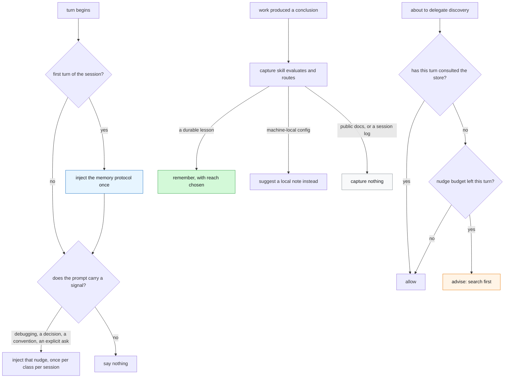
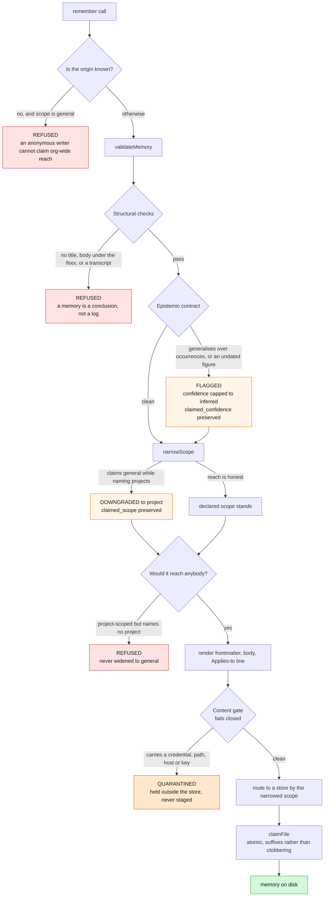
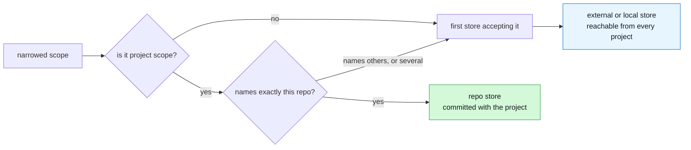
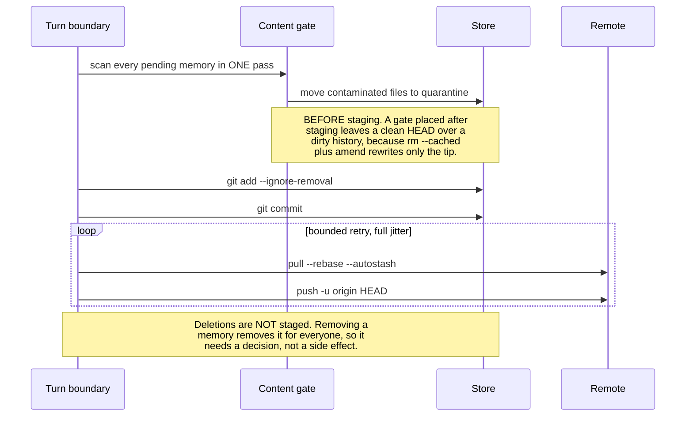

# Architecture

How a memory gets in, where it goes, and who can see it. Every box below is code that exists.

Where each piece came from — MCS, obsidian-mind, or new here — is in [PROVENANCE.md](./PROVENANCE.md). Why it is shaped this way, with the measurements that forced each choice, is in [RECORD.md](./RECORD.md).

The whole design rests on one property: **reach is declared once, and everything else is derived from it.** Storage location, visibility and ranking are all computed from the same declaration, so they cannot drift apart.

---

## The pieces

```
core/lib/memory.ts       the write contract, reach filter and pool naming
core/lib/stores.ts       store kinds, routing, and materialising an external store
core/lib/index-view.ts   per-caller search index over exactly what a caller may see
core/lib/qmd-session.ts  the search engine, kept resident for the session
core/lib/usage.ts        retrieval kept local, confirmation kept in the memory
core/lib/consolidate.ts  finds memories stating one claim; proposes, never writes
core/lib/vestige.ts      the public API: remember, recall, search, explain
core/lib/sanitize.ts     the content gate
core/lib/sync.ts         git pull/push, deletion review, bounded retry
core/lib/protocol.ts     the text that makes an agent use the store
core/setup/qmd.ts        provisioning: install, update, heal
core/setup/doctor.mjs    diagnosis
core/setup/migrate.mjs   re-route memories when the configuration changes
core/setup/import.mjs    take in an existing pile without resurrecting deletions
core/setup/consolidate.mjs  print consolidation candidates
host/                    the Claude Code surface: hooks, skills, commands, MCP
codex/                   the Codex surface: AGENTS.md and registration
```

`core/` is host-agnostic. Everything host-specific is a thin adapter, which is why the same server serves Claude Code and Codex, and why sync does not live in a hook — Codex has none.

---

## What makes any of it happen

Plumbing without a trigger is a store nobody writes to. `remember` and `search` existed for a while with nothing that ever called them, which is what this layer prevents.



Three deliberate choices:

- **The protocol goes in once per session, not once per turn.** Injecting every turn is the reliable choice and costs a paragraph of context forever; text that appears every turn also stops being read.
- **The gate advises and never hard-blocks.** A script bug must not become a gate with no escape. Nudges are budgeted per turn so the hook cannot drive a search-then-spawn loop.
- **Capturing nothing is the expected outcome.** Most sessions produce no durable memory, and a store full of near-misses is worse than a small one.

Two properties of the gate exist because this layer fails silently by construction, and both were found by running it in a live session rather than a test:

**Every decision the gate makes is appended to a bounded `gate-log.jsonl`.** From the session state alone, a nudge that fired and a nudge that was never reached are indistinguishable — and so are a hook matcher that never matched and a tool that was never called. Without the log there is no way to tell a working gate from an absent one.

**Delegations are counted while in flight.** A sub-agent's prompt arrives on the same `UserPromptSubmit` hook carrying the parent's session id *and* the parent's transcript path; nothing in the payload distinguishes it. Treated as a new turn it resets the barrier the delegation just tripped, which voids both the record that the parent searched and the per-turn nudge budget that stops the gate driving a loop. A prompt arriving during an in-flight delegation therefore does not start a new turn, with a time-to-live so an aborted delegation cannot pin the barrier open. The accepted cost — a prompt genuinely sent mid-delegation carries the previous turn's search — is written down as a test, because a trade-off nobody encoded is a bug the next session will "fix" back.

---

## The capture path

Five places can refuse or alter a write, and each records what it did.



**Reach is narrowed, never widened.** A memory claiming `general` while naming specific projects is scoped to them by its own admission. A memory that would reach *nobody* is **refused rather than widened**, because granting the widest possible reach when the narrowest could not be determined is the opposite of what narrowing is for.

**The gate fails closed and quarantines per file.** An unreadable file, an unevaluable rule or a scanner error all count as contaminated. The offending memory is held where its author can still see it, and the clean memories beside it still land — a gate that loses clean work is a gate people switch off.

---

## Where a memory goes

Storage is **configuration, not policy**. A store declares its kind and which scopes it accepts; a memory goes to the first store that accepts its narrowed scope.

| kind | where | for |
|---|---|---|
| `repo` | a directory inside the project repo | memories that travel with the code and are reviewed in its pull requests |
| `external` | a separate git repository, sparse-cloned into the workspace and locally excluded | team memory decoupled from any product repo |
| `local` | a plain directory | the personal default |



An `external` store is cloned single-branch, blobless and sparse, so only the memory markdown materialises. The remote is probed **before** anything is written — a missing SSH key, a dropped VPN, revoked access and a wrong branch otherwise all present as one empty directory. The checkout is excluded through `.git/info/exclude` rather than the project's `.gitignore`, because where an engineer keeps their memories is their choice and does not belong in shared source.

When the configuration changes, `core/setup/migrate.mjs` re-routes existing memories to the stores their reach now implies. It is a dry run by default, never overwrites a name already taken, and verifies each copy before removing the original.

---

## The recall path

**Filter first, rank second.** That order is the architecture. Reversing it — rank globally, then filter — is bounded by the retrieval engine's result ceiling, which does not move as the number of projects grows.


**A caller's platforms come from configuration, or are detected.** `platform` reach is otherwise write-only: every read built its caller with an empty platform list, no tool argument could fill it, and so every platform-scoped memory was accepted, reported as stored, and then withheld from everybody. A repo declares `platforms` in `.vestige/config.json`; failing that, unambiguous markers are used (`package.json` → node, `Cargo.toml` → rust, an `.xcodeproj` → ios and swift). Declaration wins, because guessing a platform widens reach.

**Default deny is load-bearing.** A caller with no identity sees only `general` — the safest reading of "I do not know who you are". A memory whose frontmatter will not parse is visible to nobody: a memory whose reach cannot be read has not declared a reach.

**The index is per caller and named.** Isolation is a property of the index *name*, not of a directory — running `qmd init` in a per-caller directory silently creates nothing and every collection lands in the shared default index, which would put every project's memories in one place underneath a filter whose entire job is to keep them apart. Index builds are serialised with a cross-process lock, because two sessions building at once contend on one shared cache and the loser would otherwise degrade to unranked results without saying so.

**Reach is what a per-project index cannot do.** Isolation by folder — one index per repository — gives the same in-project retrieval as a reach filter, measured identical to three decimals. What it cannot do is carry a lesson across: a memory written in one repository about a fault in a shared library is absent from every other repository's index, at any *k*. Measured over 57 such queries, each asked by a service that did not write the memory: declared reach retrieves it into the top five **77%** of the time, a shared pool **60%**, and a per-project index **0%**. Reach also decides storage — a memory reaching several projects cannot live inside one of them — so the declaration that makes it visible is the same one that puts it somewhere all of them can read.

**Both layers matter.** The filter decides what may be seen; the ranker decides which of it answers the question. Re-measured on a corpus matching a real store, symptom register:

| | rank-1 | found@5 | candidate set |
|---|---|---|---|
| reach filter alone, ordered by specificity and recency | 0.044 | 0.219 | 24 documents |
| filter **and** semantic ranking | **0.454** | **0.929** | 24 documents |

Ten times on the first slot and four times on recall. The candidate-set column is the honest framing of what the ranker is asked to do: pick the right memory out of the **24** this caller may see, not out of the whole store. The filter is what makes that number 24.

**The query is stated, not expanded.** qmd's plain-text `query` is auto-expanded by the SDK into lex/vec/**hyde** variants, and HyDE writes a hypothetical answer with a model — an LLM call on every search, whose output then feeds the ranking. Vestige passes typed sub-queries instead: lexical first (it carries 2× weight, and a memory is found by the words of the problem more often than by a paraphrase), then vector.

Measured over three runs each on the symptom register: typed gives rank-1 **0.454 with sd 0.000** — the identical result three times — against expansion's mean **0.384 with sd 0.030**, a seven-point swing between runs, because a hypothetical document is generated text that lands in the ranking. Expansion also loses on accuracy in two registers of three and is indistinguishable from noise in the third. Warm queries within one project: 26 ms against 330 ms.

`VESTIGE_QUERY_SHAPE=expand` restores expansion for a workload whose queries are worded unlike its documents — the case HyDE exists for. This corpus's queries are written from the incident record rather than from the memories, so it stresses that case more than the previous fixture did, and expansion still loses.

**The engine is resident, not re-launched per query.** Invoking the search CLI per call paid its model-loading cost every time — 2,748ms per search, almost none of it search. qmd speaks MCP over stdio, so one child is started per session and reused, keyed on the view's signature so a changed visible set re-resolves rather than answering from a stale collection. The child is unreferenced from the event loop and torn down on exit, because a resident child otherwise keeps a CLI or a test runner from ever exiting.

**Reranking is off, and that is a measurement rather than a default — though a more interesting one than it first appeared.** On a corpus of realistic length it is *not* inert: compared list by list it changes the top-5 **set** for roughly half of 183 queries. What it does not change is the answer. rank-1 is identical to the digit in all three query registers (0.454, 0.530, 0.328) and the entire miss breakdown is unchanged, while found@5 rises 0.929 → 0.956, 0.880 → 0.918 and 0.836 → 0.902, at **28–34× the warm-query latency** (729–756 ms against 22–26 ms).

So the default is conditional on what the caller reads: a consumer of the top hit pays 30× for an answer that cannot change; one that reads five gains 2.7 to 6.6 points of recall. It stays off, and `VESTIGE_RERANK=1` turns it on for the second case.

> An earlier version of this paragraph reported **byte-identical hit lists on every query**. That was true of the fixture it was measured on — documents averaging 75 words leave nothing to reorder — and it is not true here. The conclusion survived the corpus change; the mechanism behind it did not.

> An earlier version of this paragraph claimed the reranker actively *hurt* accuracy: 0.906 against 1.000, with four of sixty-four queries falling back to unranked results. **That does not reproduce.** It came from a harness that timed the two arms without scoring them, where those four fallbacks were a defect in the run rather than an effect of reranking. The narrower claim is the one the evidence supports, and it is still enough to justify the default — a stage that cannot change the answer has no accuracy case to make.

**The first query for a caller builds that caller's view index**, which costs seconds; every subsequent query in the session does not. Both are reported separately in the benchmarks, since one mean over the two describes neither.

---

## Which models run, and which ones do not

Retrieval is not one model. [qmd](https://github.com/tobi/qmd) holds three model slots and **Vestige uses only the first**. Which ones run explains every latency number above, so both the models and the choice are recorded here — the models are qmd's to change, and if these fall out of date the fix is to update this table:

| slot | model, as qmd configures it | used | why |
|---|---|---|---|
| embed | `embeddinggemma-300M` (Q8_0, ~300M params) | **yes** | one vector per query, one per chunk at index time. The lexical half of the query costs no model at all — BM25 over an index — so a warm query inside one project is 22–26 ms |
| generate | `qmd-query-expansion-1.7B` (Q4_K_M) | no | the auto-expansion, HyDE included. ~500 ms per query, and a *hypothetical document* is generated text, so it lands in the ranking and moves between runs |
| rerank | `Qwen3-Reranker-0.6B` (Q8_0) | no | reorders half the shortlists and changes the first slot in almost none, for 28–34× the latency |

Written out, the arithmetic stops being surprising: a 1.7B generative model and a 600M cross-encoder were running on every search, and a 300M embedder was doing the part that produced the answer.

Both refusals are measurements rather than preferences. Skipping expansion takes rank-1 from 0.384 (sd 0.030) to 0.454 (sd 0.000) and a warm query from 330 ms to 26 ms — roughly 92% of what used to be called "search latency" was a model writing a paragraph nobody read.

Everything runs locally through qmd: **nothing leaves the machine at query time and there is no API key anywhere in this system.** That matters more for a memory store than it would elsewhere — the corpus is the most sensitive thing a team owns, and a hosted embedder on every search would undo the content gate.

> The trade this accepts: expansion exists for a query worded unlike the documents it should find, and this corpus does not stress that case. `VESTIGE_QUERY_SHAPE=expand` puts it back, at the cost now documented.

## The sync path, and why the order matters



Both notes are properties the code enforces rather than intentions. Placing the gate after staging produced a clean `HEAD` over a dirty history — every contaminated memory still reachable in the remote — because retraction is not containment for anything append-only.

The single pass matters too: one process per file cost 5.67s on a 200-memory store; batched it is 29ms.

Sync runs from the server on a debounce, and the Claude hooks are an optimisation that syncs at a natural boundary. Correctness does not depend on any host feature.

---

## What the audit trail records

Nothing is silently rewritten. Every intervention keeps the original assertion beside the outcome, which is what makes a narrowing auditable rather than merely correct.

| Field | Written when | Answers |
|---|---|---|
| `origin` | always, from the caller's MCP roots — not from the payload | who wrote this, and may they claim what they claimed |
| `scope` / `projects` / `platforms` | always | who can see it |
| `claimed_scope` | reach was narrowed at write time | what the writer asked for, and what they got |
| `confidence` | always | how strongly it is asserted |
| `claimed_confidence` | a flagged claim was capped | that the contract intervened, and on what |
| `flags` | the contract fired | which rule, so a review can list every weak claim without re-reading a body |
| *derived* foreignness | computed at read time from `origin` vs `projects` | whether it was written from outside every project it claims |

Foreignness is **derived, not stamped**. A stamped marker was tried first and shipped inert, because the facet normaliser keeps only the fields the visibility rule needs. Deriving it also closes the evasion: a writer cannot suppress a property the reader computes for itself.

The `explain` tool renders this per memory with the reason each was shown or withheld — every failure in this layer otherwise presents identically as *no results*.

---

## What usefulness is allowed to change

Two signals, kept in different places on purpose.

**Retrieval is per-reader and frequent**, so it lives in a local log that is never synced and never committed. Writing it into the memory would rewrite shared files on every search — turning a store people review in pull requests into a stream of telemetry commits — and would publish who reads what.

**Confirmation is evidence about the claim**, so it is written into the memory itself, where the next reader sees it. It is idempotent per day per project: a number that inflates on repetition stops meaning anything.

Neither hides a memory. Never-retrieved is not useless — a memory nobody has needed yet is exactly what a store is for — so both only break ties that specificity and recency already left level, and the bonus is capped so popularity cannot displace relevance.

## What is deliberately absent

Stated so nobody assumes otherwise:

- **No episodic tier.** Only durable lessons. Session logs are a different artifact with different ranking needs, and the claim that mixing them degrades both was tested here up to 5.6 logs per lesson and **did not reproduce** — so the tier is not built on a borrowed argument.
- **No consolidation.** Repeated observations do not promote into a rule.
- **No decay or confirmation.** Nothing tracks whether a memory was ever retrieved or ever useful, so nothing can sink on evidence.
- **The content gate is a deny-list.** It catches credentials, keys, UUIDs, home paths, emails, internal hostnames and private IPs, including base64-wrapped ones. It cannot see a secret spaced out character by character or described in prose. Measured, not assumed.
